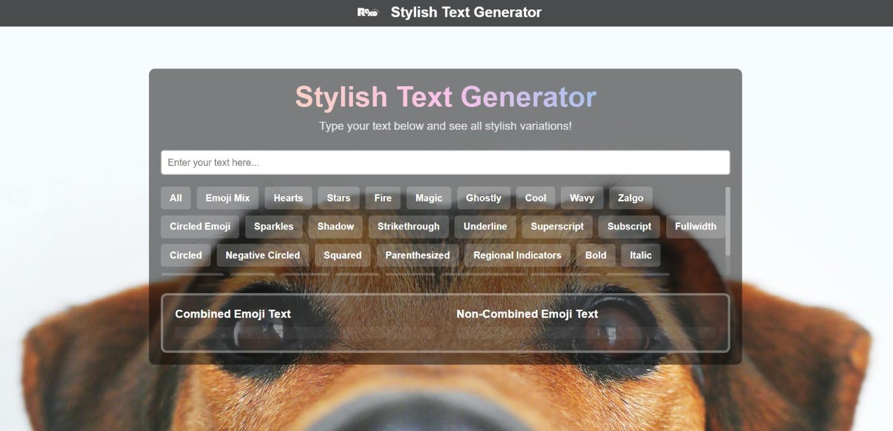

# Stylish Text Generator ✨



A web tool that transforms ordinary text into stylish, eye-catching variations with emoji combinations and special formatting.

## 🌟 Features

- **Instant Text Transformation**: Convert plain text to stylish versions in real-time
- **Dual Output Modes**:
  - Combined emoji text (emojis merged with letters)
  - Non-combined emoji text (emojis separate from text)
- **Category System**: Organized stylish text variations
- **Responsive Design**: Works on all devices
- **Copy-Paste Ready**: Directly use outputs for social media

## 🛠 Technologies Used

| Frontend       | Styling       | Functionality  |
|----------------|---------------|----------------|
| HTML5          | CSS3          | JavaScript ES6 |
| Semantic HTML  | Flexbox       | DOM Manipulation |

## 🚀 Quick Start

1. Clone the repository:
   ```bash
   https://github.com/rn-swain/Stylish-Text-Generator.git
